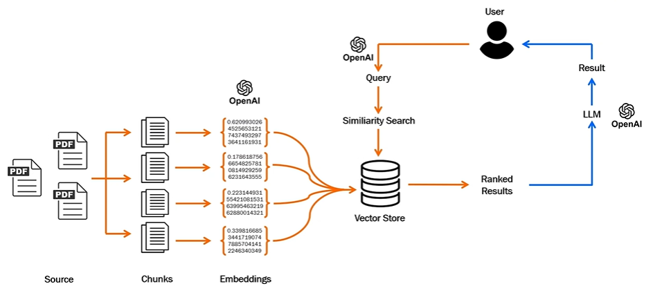
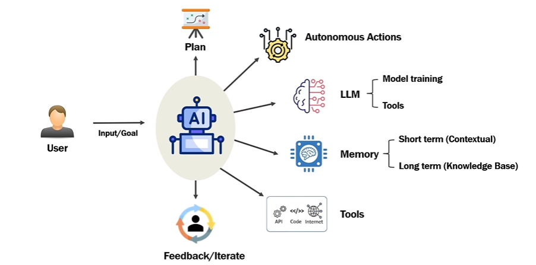

# 🚀 Generative AI – Complete Guide

## 📌 Overview
This repository contains structured notes and concepts on **Generative AI**, including its foundations, architectures, and advanced topics like RAG and Agentic AI.

Generative AI focuses on **creating new content** such as:
- Text
- Images
- Audio
- Video
- Source Code

---

## 🧠 Artificial Intelligence (AI)
Artificial Intelligence (AI) is a field of computer science focused on building systems capable of performing tasks that typically require human intelligence.

---

## 🤖 Machine Learning (ML)
Machine Learning is a subset of AI that allows systems to:
- Learn from data  
- Make predictions  
- Improve over time  

### Requirements:
- Training data  
- Computational power  
- Algorithms  

---

## 🧬 Deep Learning
Deep Learning is a subset of ML that uses neural networks inspired by the human brain to process data and make decisions.

---

## ✨ Generative AI
Generative AI is a subset of deep learning that generates new content.

### 🔄 Traditional AI vs Generative AI

| Traditional AI | Generative AI |
|---------------|--------------|
| Prediction | Content Creation |
| Classification | Text, Image, Video Generation |
| Structured Output | Creative Output |

---

Gen AI is more towards conversational, contextual understanding(needs massive GPU, infrastructure, data centers)

## 💬 Large Language Models (LLMs)

LLMs are models designed for:
- Understanding language  
- Generating human-like text  

Examples:
- OpenAI [All purpose]  
- Gemini [All purpose]  
- Claude [good at code generation]  
- Copilot 
- Grok
- Perplexity 

---

## ⚙️ How LLM Works

### Transformer Architecture
- Backbone of LLMs  
- Understands context and relationships in text  

### Key Concepts:
- Pre-training (large dataset)  
- Fine-tuning (task-specific)  
- Massive scale networks  

---

## 🛠️ Use Cases
- Content generation  
- Chatbots  
- Translation  
- Summarization  
- Q&A systems  

---

## 🎯 Prompt Engineering
Prompt engineering is the process of designing effective inputs to guide AI responses.

---

## 🔢 Embeddings
- Convert text → numerical vectors  
- Enable semantic understanding  

---

## 🔄 Fine-Tuning
Adapting a pretrained model for specific use cases.

### Types:
- Supervised  
- Self-supervised  
- Reinforcement learning  

---

## 📚 Retrieval-Augmented Generation (RAG)

### ❗ Problems Solved
- Knowledge cutoff  
- No access to private data  
- Hallucinations  (Answers based on facts, not guesses)

---

### 🧩 RAG Breakdown
- **Retrieval** → Find relevant data  
- **Augmentation** → Add data to prompt  
- **Generation** → Generate response  

---

### ✅ Benefits of RAG
- Accurate answers  
- Reduced hallucinations  
- Private data usage  
- Source-backed responses  

---

## 🏗️ System Architecture

---

## 🤖 Agentic AI

Agentic AI systems can:
- Plan  
- Decide  
- Act autonomously  

### Components:
- Goal  
- Planning  
- Tools  
- Memory  
- Feedback loop  

---

## 🧠 Agent Workflow

---

## ⚖️ Responsible AI

### 🚨 Challenges
- Bias & discrimination  
- Privacy concerns  
- Legal risks  
- Loss of trust  

---

### 🛡️ Implementation
- Data quality  
- Transparency  
- Consent & compliance  
- Monitoring & improvement  
- Human-in-the-loop  

---

## 📌 Conclusion
Generative AI enables machines to:
- Understand context  
- Generate content  
- Assist humans intelligently  

Responsible and ethical implementation is critical.

---
